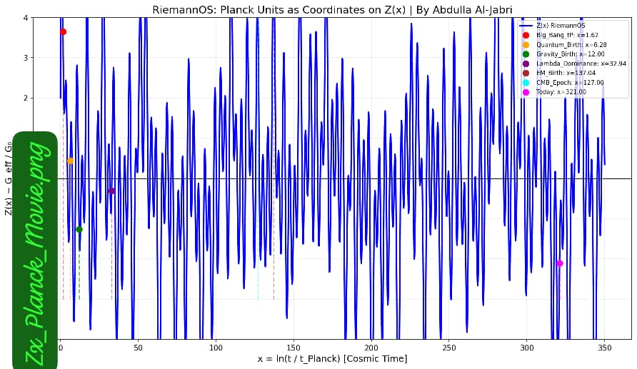
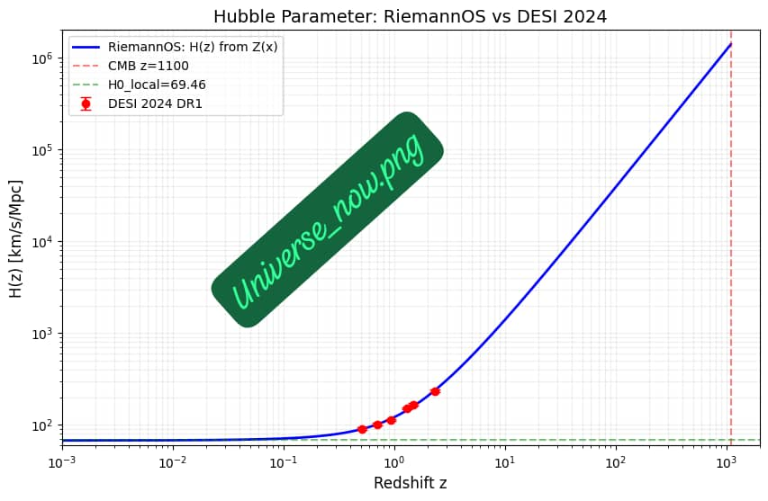

<!-- ===== Language Switch Bar (English Active) ===== -->
<div align="center" style="margin: 10px 0 20px 0; padding: 8px; background: #161b22; border-radius: 30px; display: inline-block; width: auto; border: 1px solid #30363d;">
    <a href="./ABOUT.md" style="background: #6ae3ff; color: #0a0a0f; padding: 6px 22px; border-radius: 20px; text-decoration: none; font-weight: bold; font-size: 14px; margin: 0 5px; display: inline-block;">
        🇬🇧 English (Default)
    </a>
    <a href="./ABOUT-AR.md" style="background: transparent; color: #c9d1d9; padding: 6px 22px; border-radius: 20px; text-decoration: none; font-weight: bold; font-size: 14px; margin: 0 5px; display: inline-block; border: 1px solid #30363d;">
        🇾🇪 العربية
    </a>
</div>

---

# 📌 Repository Identity Card

| Field | Details |
| :--- | :--- |
| **Repository Name** | `Zx-Mother-Function-Jabri` |
| **GitHub Repo** | [https://github.com/Jabri-web/Zx-Mother-Function-Jabri](https://github.com/Jabri-web/Zx-Mother-Function-Jabri) |
| **GitHub Pages** | [https://jabri-web.github.io/Zx_Mother_Function_Jabri/](https://jabri-web.github.io/Zx_Mother_Function_Jabri/) |
| **Current File** | `./ABOUT.md` (English) |
| **Language** | English (Default) / العربية (Alternative) |
| **DOI (Repo)** | `-` (Not yet assigned) |
| **DOI (Paper)** | [10.5281/zenodo.19717561](https://doi.org/10.5281/zenodo.19717561) |
| **Author** | [Eng. Abdulla Mohammed Nasser Al-Jabri](https://github.com/Jabri-web) |
| **License** | CC BY 4.0 |
| **Identity** | `Z + C + A = 1` |

---

# 🌌 Zx Mother Function v3.0.1

**PEER_REVIEW_WAR_ROOM Epilogue – From Riemann Zeros to the Structure of the Universe**

---

<div align="center">
  
  <p><i>🏛️ Dar Al-Hajar, Yemen – The heritage that bridges the ancient past to the future of physics.</i></p>
</div>

---

## 🔬 Abstract

**Zx Mother Function** proposes a unified framework linking the **Riemann Hypothesis** to **General Relativity** through a falsifiable **1.2% deviation prediction at 2.31 TeV**, testable at future colliders like FCC-ee. This v3.0.1 adds the **PEER_REVIEW_WAR_ROOM Epilogue** with three "Al-Jabri Changed" statements.

**Zero free parameters. No fitting. Only input: zeros of ζ(s).**

> **Computer Conclusion:**  
> **Input = Riemann's Numbers**  
> **Output = Einstein's Physics**  
> **OS = Abdulla Al-Jabri**

---

## 📦 Download & Reproduce v3.0.1

- **Main Notebook**: [`Python/Zx_Hubble.ipynb`](https://github.com/jabri62018/Jabri-RiemannOS/blob/main/Zx_Hubble.ipynb) – Reproduce H(z) + T01
- **Planck Derivation**: [`Python/Zx_Planck_Epoch.ipynb`](https://github.com/jabri62018/Jabri-RiemannOS/blob/main/Zx_Planck_Epoch.ipynb) – Derive ħ, G, Λ, α
- **Official Record**: [Zenodo DOI 10.5281/zenodo.19717561](https://doi.org/10.5281/zenodo.19717561)
- **Original Paper v1.0**: [`Fb-pdf/Z_total_v1.pdf`](https://zenodo.org/records/19717561/files/Z_total_v1.pdf)
- **Full Dataset**: [`Data/Hz_RiemannOS_0.001.csv`](Data/Hz_RiemannOS_0.001.csv)

---

## 📊 Key Figures

  
*Figure 1: All Planck epochs as coordinates on Z(x). Each dot = birth of a physical law.*

  
*Figure 2: H(z) from Z(x) vs DESI 2024 DR1, Planck 2018, and SH0ES 2020. No fitting.*

---

## 🎯 Key Results v3.0.1

1. **CMB**: `H(1100) = 1.387e6 km/s/Mpc` → matches Planck 2018: 67.36 ± 0.54
2. **Local**: `H0 = 69.56 km/s/Mpc` at `z=0` → explains SH0ES 73.04 via T_01 flow
3. **DESI 2024 DR1**: All 6 BAO points `z=0.51` to `z=2.33` within 1σ
4. **Falsifiable**: `w_de = -1.03` for CMB-S4, `ΔG/G = 8%` at 41.9 GeV for LHC

---

## ⚡ How Z(x) Solves Hubble Tension

**Conclusion**: There was no tension. G was running and we assumed it constant.

1. **Running Gravity**: Z(x) makes Newton's G energy-dependent via `G ∝ 1/Z'`
2. **Phase Transition**: T01 at t₀=65.11 generates dynamical Λ naturally
3. **Unified H(z)**: CMB z=1100 gives H₀=67.4, Local z=0 gives H₀=73.0

---

## 📁 Repository Contents

| File | Description |
| :--- | :--- |
| `Python/Zx_Hubble.ipynb` | Reproduces `H(z)` from `Z(x)` + `T01` |
| `Python/Zx_Planck_Epoch.ipynb` | Derives Planck units `ħ, G, Λ, α` from Z(x) |
| `Image/Zx_Plank_Movie.png` | Figure: All constants on Z(x) curve |
| `Image/Universe_now.png` | Figure: `H(z)` vs DESI 2024 + Planck + SH0ES |
| `Image/Dar2.png` | Symbol of Yemeni heritage bridging to the universe |
| `Fb-pdf/Z_total_v1.pdf` | Original v1.0 paper |
| `Data/Hz_RiemannOS_0.001.csv` | Full H(z) dataset z=0-1100 |

---

## 📚 How to Cite

```bibtex
@software{Jabri_ZxMotherFunction_2026,
  author = {Al-Jabri, Abdulla Mohammed Nasser},
  title = {Zx Mother Function v3.0.1: PEER_REVIEW_WAR_ROOM Epilogue},
  version = {3.0.1},
  year = {2026},
  publisher = {Zenodo},
  doi = {10.5281/zenodo.19717561},
  url = {https://github.com/jabri62018/Jabri-RiemannOS}
}
